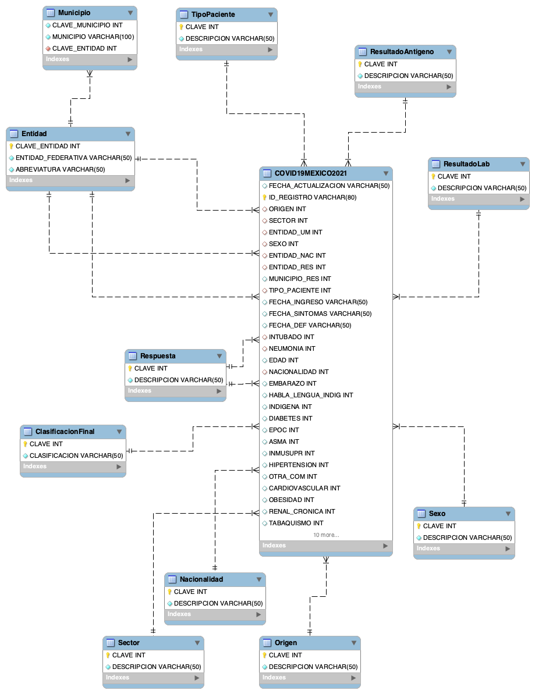

# COVID-19: México en Datos

# Introducción

En el presente trabajo se analizará el repositorio de datos abiertos de la Secretaría de Salud Federal referentes a la pandemia de COVID-19 durante el año 2021 en nuestro país. 

La fuente de los datos es la misma Secretaría de Salud, en su apartado de [datos abiertos](https://www.gob.mx/salud/documentos/datos-abiertos-152127). Para este análisis, tomamos los datos históricos del 2021, los cuales se encuentran almacenados en un archivo .csv (valores separados por comas) con un peso aproximado de 1.5 Gb. Este archivo contiene todos los datos sospechosos de covid registrados en instituciones médicas del país entre el 1 de enero de 2021 y el 29 de julio de 2022. 

Cada fila en esta base representa un paciente admitido en un Centro Médico del país por posible contagio de COVID-19. Las diferentes columnas representan diversas características o padecimientos del paciente, tales como su lugar de residencia, de nacimiento, la ubicación de la unidad médica donde se atendió y si era una institución pública o privada, si sufría de diabetes, hipertensión, EPOC, u otras condiciones, si pertenecía a una comunidad indígena, entre otros.

# Explorando los datos

## Estructura de la Base de Datos

Para generar nuestra base de datos MySQL, utilizaremos un único archivo csv proporcionado por la Secretaría de Salud. Sin embargo, utilizando el diccionario de datos proporcionado por la misma Secretaría, podemos generar tablas adicionales para complementar nuestra tabla principal. Una vez realizado este proceso, nuestra base de datos contaría con la siguiente estructura.



Estas relaciones nos permitirán, como veremos más adelante, analizar e interpretar más facilmente los datos que recabaremos con nuestras queries. Las queries utilizadas estarán disponibles en el repositorio del proyecto. 

## Analizando los datos de nuestra base

### ¿Cuántos casos registró la Secretaría?

Comenzamos analizando la cantidad total de registros en nuestra tabla principal, para eso podemos utilizar una query simple utilizando la función COUNT.

```SQL
SELECT 
	COUNT(*) AS FILAS_TOTALES
FROM 
	covid.COVID19MEXICO2021 cm 
```

La cual nos arroja el siguiente resultado:

|FILAS TOTALES|
|-------------|
|8,710,345|

Esto nos indica que existen mas de ocho millones de entradas en nuestra base de datos. Sin embargo, no todos estos casos fueron casos confirmados de la enfermedad, ya que la columna ```CLASIFICACION_FINAL``` de nuestra tabla principal nos indica si el caso fue confirmado como COVID. Si nos vamos a la tabla ```Clasificacion``` de nuestra base, vemos que los valores 1,2 y 3 de la columna son considerados como *confirmados*. Tomando esto en cuenta, podemos observar que el número de casos confirmados es mucho menor al número de entradas de la tabla.

Podemos realizar un query uniendo nuestra tabla principal con la tabla de Clasificacion:

```SQL
SELECT 
	cf.CLASIFICACION AS CLASIFICACION,
	COUNT(cm.ID_REGISTRO) AS TOTAL
FROM 
	covid.COVID19MEXICO2021 cm 
INNER JOIN 
	covid.ClasificacionFinal cf ON cf.CLAVE = cm.CLASIFICACION_FINAL 
WHERE 
	cm.CLASIFICACION_FINAL < 4 /* solo casos confirmados */
GROUP BY
	cf.CLASIFICACION WITH ROLLUP /* total de los datos agrupados */
```
En este caso, la tabla de ```Clasiifacion``` nos ayudó a generar un filtro para tomar en cuenta sólo los casos confirmados. Al ejecutar la query anterior, obtenemos una tabla indicando la cantidad de casos confirmados, dividios según la forma en que fueron clasificados como tal.

|CLASIFICACION|TOTAL|
|-------------|-----|
|Casos confirmado por prueba|2,276,031|
|Casos confirmados por asociación|215,863|
|Casos confirmados por dictaminación|4,182|
|Total|2,496,076|

Esto nos indica que de los más de ocho millones de casos sospechosos, "solo" dos millones y medio de ellos resultaron positivos.

#### **¿Cómo fuerón detectados estos casos?**

Utilizando la tabla ```Sector```, así como la columna del mismo nombre en nuestra tabla principal, podemos apreciar la distribución de dónde fueron detectados estos casos.

```SQL
SELECT
	s.DESCRIPCION  AS INSTITUCION,
	(COUNT(*) / (SELECT COUNT(*) FROM covid.COVID19MEXICO2021 cm WHERE cm.CLASIFICACION_FINAL < 4)) * 100 AS PORCENTAJE
FROM 
	covid.COVID19MEXICO2021 cm
INNER JOIN 
	covid.Sector s  ON s.CLAVE = cm.SECTOR  
WHERE 
	cm.CLASIFICACION_FINAL < 4 /* cualquier valor menor a 4 indica que el caso fue considerado como positivo */
GROUP BY
	s.DESCRIPCION 
ORDER BY
	PORCENTAJE DESC
```

La query anterior nos muestra los diferentes tipos de instituciones médicas donde fueron detectados casos positivos de COVID, así como el porcentaje correspondiente a cada una.

|INSTITUCION|PORCENTAJE|
|-----------|----------|
|SSA|47.0565|
|IMSS|44.8462|
|PRIVADA|2.8582|
|ISSTE|2.4101|
|ESTATAL|0.9662|
|IMSS-BIENESTAR|0.7007|
|PEMEX|0.4616|
|SEDENA|0.4120|
|SEMAR|0.1519|
|MUNICIPAL|0.0682|
|UNIVERSITARIO|0.0458|
|CRUZ ROJA|0.0111|
|DIF|0.0105|
|NO ESPECIFICADO|0.0009|
|OTROS|0.0000|

De la tabla anterior, podemos observar que la gran mayoría de los casos (más del 90%) fueron confirmados en instituciones públicas federales.

### ¿Cuántos casos resultaron en defunciones?

Anteriormente vimos que se presentaron más de dos millones de casos confirmados del COVID-19 en este periodo, pero ¿cuántos de estos casos culminaron con el fallecimiento del paciente? Para ello podemos basarnos en la columna ```FECHA_DEF```, la cual asigna una fecha cuando el paciente falleció, o ```9999-99-99``` cuando sobrevivió.

```SQL
SELECT 
	COUNT(*) AS Defunciones_Totales
FROM
	covid.COVID19MEXICO2021 cm 
WHERE 
	cm.FECHA_DEF != '9999-99-99'
```
Con esta query podemos obtener el número de casos positivos que resultaron en defunciones:

|Defunciones_Totales|
|-------------------|
|180,055|

Aprovechando esta misma columna, podemos obtener más información referente a las defunciones por covid, por ejemplo, ¿cuál fue el día donde se registraron más defunciones en este periodo? ¿cuantás defunciones se registraron ese día? Podemos aprovechar la función ```GROUP BY``` y ```ORDER BY``` de SQL para responder estas preguntas:

```SQL
SELECT 
	DISTINCT (FECHA_DEF),
	COUNT(FECHA_DEF) AS FALLECIMIENTOS
FROM 
	COVID19MEXICO2021 cm 
WHERE 
	FECHA_DEF != '9999-99-99'
GROUP BY 
	FECHA_DEF
ORDER BY 
	FALLECIMIENTOS DESC
LIMIT 
	5
```

Al ejecutar este query, podemos observar que el día 25 de enero de 2021 se registraron 1,506 fallecimientos por esta enfermedad, siendo el día con más fallecimientos registstrados en este periodo.

|FECHA_DEF|FALLECIMIENTOS|
|---------|--------------|
|2021-01-25|1,506|
|2021-01-26|1,492|
|2021-01-24|1,449|
|2021-01-21|1,429|
|2021-02-01|1,423|

Ya vimos como se distribuyeron las defunciones a lo largo de este periodo, pero, ¿cómo se distribuyeron a lo largo de la República? ¿cuál fue el estado que concentró la mayor cantidad de defunciones?. Para resolver estas incógnitas hacemos uso de la tabla ```Entidad``` de nuestra base de datos.

```SQL
SELECT 
	e.ENTIDAD,
	COUNT(cm.ID_REGISTRO) AS TOTAL
FROM 
	covid.COVID19MEXICO2021 AS cm 
INNER JOIN
	covid.Entidad AS e ON e.CLAVE = cm.ENTIDAD_UM 
WHERE 
	cm.FECHA_DEF != '9999-99-99'
GROUP BY
	e.ENTIDAD
ORDER BY
	TOTAL DESC
```

Al ejecutar esta query, podemos observar que la Entidad que presentó el mayor número de defunciones en este periodo fue la Ciudad de México, con 29,784 defunciones. Por otro lado, vemos que en Chiapas se registró el menor número de defunciones, con un total de 1,032.

|ENTIDAD|TOTAL|
|-------|-----|
|CIUDAD DE MEXICO|29,764|
|MEXICO|17,256|
|JALISCO|12,447|
|NUEVO LEON|10,142|
|PUEBLA|9994|
|VERACRUZ DE IGNACIO DE LA LLAVE|9401|
|GUANAJUATO|7959|
|SINALOA|5787|
|MICHOACAN DE OCAMPO|5635|
|BAJA CALIFORNIA|5285|
|SONORA|4832|
|TAMAULIPAS|4684|
|YUCATAN|4568|
|CHIHUAHUA|4467|
|HIDALGO|4415|
|SAN LUIS POTOSI|4105|
|GUERRERO|3977|
|COAHUILA DE ZARAGOZA|3903|
|QUERETARO|3662|
|OAXACA|3483|
|MORELOS|3408|
|TABASCO|3239|
|QUINTANA ROO|2431|
|AGUASCALIENTES|2278|
|NAYARIT|2275|
|BAJA CALIFORNIA SUR|1858|
|DURANGO|1734|
|ZACATECAS|1704|
|COLIMA|1580|
|TLAXCALA|1482|
|CAMPECHE|1268|
|CHIAPAS|1032|

#### **Complicaciones pre-existentes**

Al tener los datos de las defunciones, nos podemos preguntar si las condiciones que ya presentaban los pacientes pudieron tener un efecto en la supervivencia del paciente. Podríamos inferir esto observando el porcentaje de pacientes fallecidos que ya presentaban otras complicaciones, ya que esta información también se encuentra presente en nuestra tabla principal. Por ejemplo, utilizando la columna ```TABAQUISMO``` podemos calcular el porcentaje de defunciones que ya presentaban este padecimiento.

```SQL
SELECT
	r.DESCRIPCION AS TABAQUISMO  ,
	(COUNT(*) / (SELECT COUNT(*) FROM covid.COVID19MEXICO2021 cm WHERE cm.FECHA_DEF != '9999-99-99')) * 100 AS PORCENTAJE_DEF /* utilizamos una sub query para obtener el total de fallecimientos, y poder conseguir un porcentaje */
FROM 
	covid.COVID19MEXICO2021 cm
INNER JOIN 
	covid.Respuestas r ON r.CLAVE = cm.TABAQUISMO  /* los valores de la columna TABAQUISMO estan relacionados con la tabla Respuestas */ 
WHERE 
	FECHA_DEF != '9999-99-99'
GROUP BY
	r.DESCRIPCION 
ORDER BY
	r.DESCRIPCION DESC
```

Sin embargo, podemos apreciar que sólo el 7% de los pacientes que fallecieron sufrían de tabaquismo, por lo que es posible que no sea un factor importante.

|TABAQUISMO|PORCENTAJE_DEF|
|----------|--------------|
|SI|7.3783|
|SE IGNORA|0.4388|
|NO|92.1829|

Utilizando queries similares, podemos generar la misma tabla par a diferentes padecimientos. Por ejemplo, podemos ver que solo el 2.5% de los pacientes fallecidos presentaban inmunosupresión.

|INMUNOSUPRIMIDO|PORCENTAJE_DEF|
|---------------|--------------|
|SI|2.5059|
|SE IGNORA|0.4071|
|NO|97.0870|

Por otro lado, el porcentaje de difuntos que presentaban algún grado de Obesidad asciende al 18%, por lo que este padecimiento sí puede ser considerado como un factor de riesgo.

|OBESIDAD|PORCENTAJE_DEF|
|--------|--------------|
|SI|18.4682|
|SE IGNORA|0.3466|
|NO|81.1852|

Finalmente, vemos que es poco probable que otras complicaciones no tan relevantes, indicadas en la columna ```OTRAS_COM```, pudieran tener un efecto en la supervivencia de los pacientes, ya que solo el 5% de las defunciones presentaban otro tipo de complicaciones.

|OTRAS_COMPLICACIONES|PORCENTAJE_DEF|
|--------------------|--------------|
|SI|5.3311|
|SE IGNORA|0.9797|
|NO|93.6892|

### Información adicional

Si bien pudimos conseguir algunos de los datos más importantes a partir de lo que se encuentra en esta base de datos, existe aun más información por descubrir respecto a esta enfermedad y como afectó a cada unos de nosotros en el país.